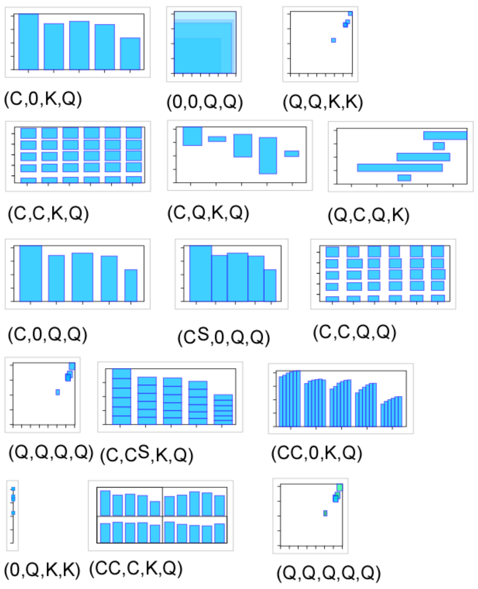

# Visual grammar

## Bertin's visual grammar
The previous grammar is an expansion of Bertin's simpler grammar. His book [Semiology of graphics](http://www.amazon.com/Semiology-Graphics-Diagrams-Networks-Maps/dp/1589482611/ref=asap_bc?ie=UTF8) is a must-read. 

According to Bertin, the two planar dimensions are the most important visual variables, then come size, value, texture, color, orientation, shape. 

### The structure of Information Visualization Design Space [pdf](http://faculty.utpa.edu/fowler/vis-papers/Card-Mackinlay_1997_Structure-of-IV-Design-Space.pdf)  
This paper describes how to map data types (e.g. ordinal, categorical, numerical) to graphical variables

<table>
  <colgroup span="4"></colgroup>
  <colgroup span="1"></colgroup>
  <colgroup span="6"></colgroup>
  <colgroup span="2"></colgroup>
  <tr>
    <th colspan="4" scope="colgroup">Data</th>
    <th colspan="1" scope="colgroup">Controlled</th>
    <th colspan="6" scope="colgroup">Automatic</th>
    <th colspan="2" scope="colgroup">Interaction</th>
  </tr>
  <tr>
    <td>Variable</td>
    <td>D</td>
    <td>F</td>
    <td>D'</td>
    <td>CP</td>
    <td>M</td>
    <td>R</td>
    <td>X</td>
    <td>Y</td>
    <td>Z</td>
    <td>T</td>
    <td>V</td>
    <td>W</td>
  </tr>
    <tr>
    <td>&nbsp</td>
    <td></td>
    <td></td>
    <td></td>
    <td></td>
    <td></td>
    <td></td>
    <td></td>
    <td></td>
    <td></td>
    <td></td>
    <td></td>
    <td></td>
  </tr>
</table> 

Symbol Meaning  
D: Data Type e.g. Nominal, Ordinal, Quantitative, Spatial, Geographical, Graphs  
F: Function for recoding data e.g. filter, sorting  
D’: Recoded Data Type (see D)  
CP: Control Processing tx (text)   
M: Mark types e.g. Point, Line, Surface, Area, Volume  
R: Retinal properties e.g. Color, Size, Connection, Enclosure  
XYZT: Position in space time  
V: View transformation e.g. hyperbolic mapping  
W: Widget e.g. slider, radio buttons

Grammar  
Marks: (Point, Line, Area, Surface, Volume)  
Controlled Processing Graphical Features  
Automatically Processed Graphical Properties  
Retinal encodings: (Color, Size, Shape, Gray-level, Orientation, Texture, Connection, Enclosure)  
Position: (X, Y, Z, T)

## A simplified grammar

Here is a somewhat simplified grammar that is a practical subset to design datavis.

Data types (taken from [pdf](http://profs.etsmtl.ca/mmcguffin/research/2012-viau-connectedCharts/viau-eurovis2012-connectedCharts.pdf)): **categorical**, **quantitative**, **constant**  
Graphical variables: **x**, **y**, **size**, **angle**, **color**  
Assembly strategies: **adjacency**, **nesting**, **linking**