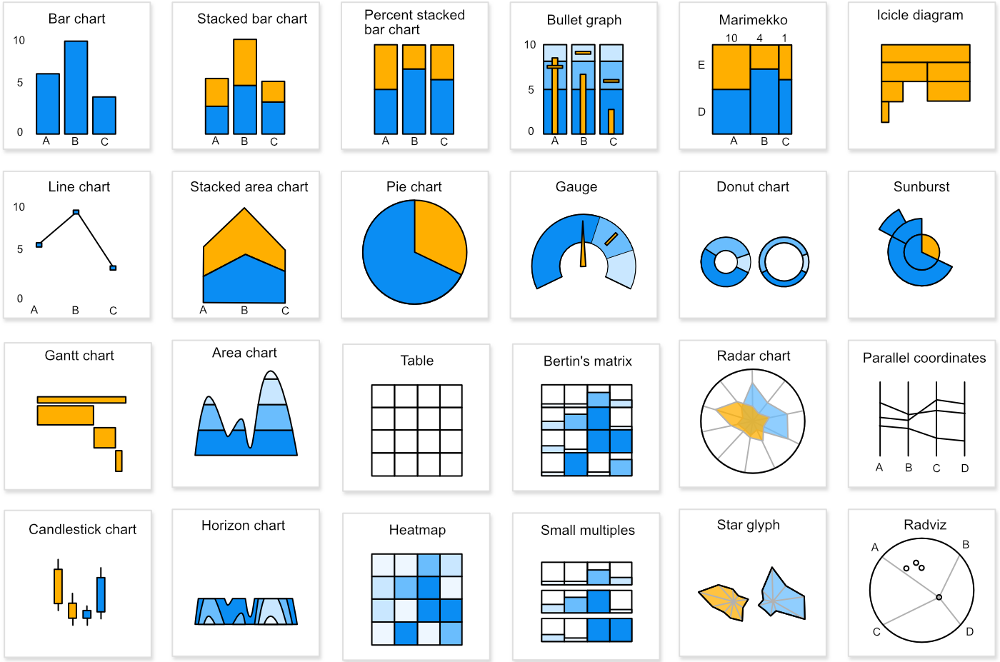
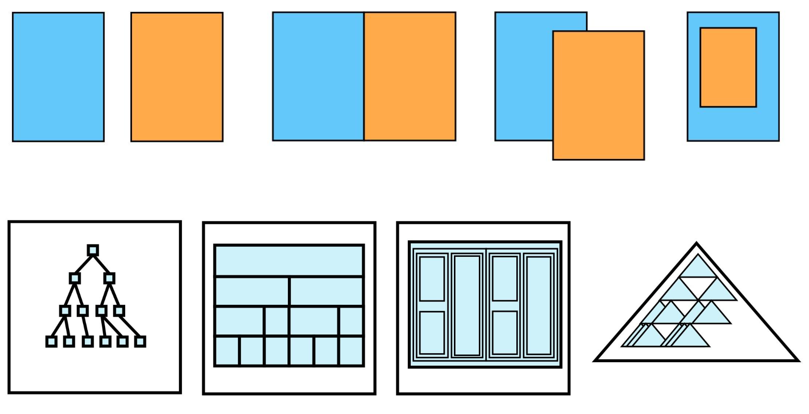

# Start from standards and explore

## Various type of graphics

* Gallery with [2500 examples](http://christopheviau.com/d3list/gallery.html)
* Gallery with [12000 examples](http://blockbuilder.org/search)
* [Adjacency Matrix](https://bost.ocks.org/mike/miserables/)
* [Bertin's Matrix](https://github.com/jdfekete/reorder.js/wiki/Introduction)
* [Horizon Charts](http://vis.berkeley.edu/papers/horizon/)
* [Bullet Graph](https://www.perceptualedge.com/blog/?p=217)
* [Sunburst](https://www.jasondavies.com/coffee-wheel/)
* [Ternary Plot](http://bl.ocks.org/biovisualize/c43740892e8f96769084bcf3e0bb7839)
* [Marimekko Chart](http://bl.ocks.org/mbostock/1005090)
* [Radviz](https://github.com/biovisualize/radviz)
* [Parallel Coordinates](http://exposedata.com/parallel/)

