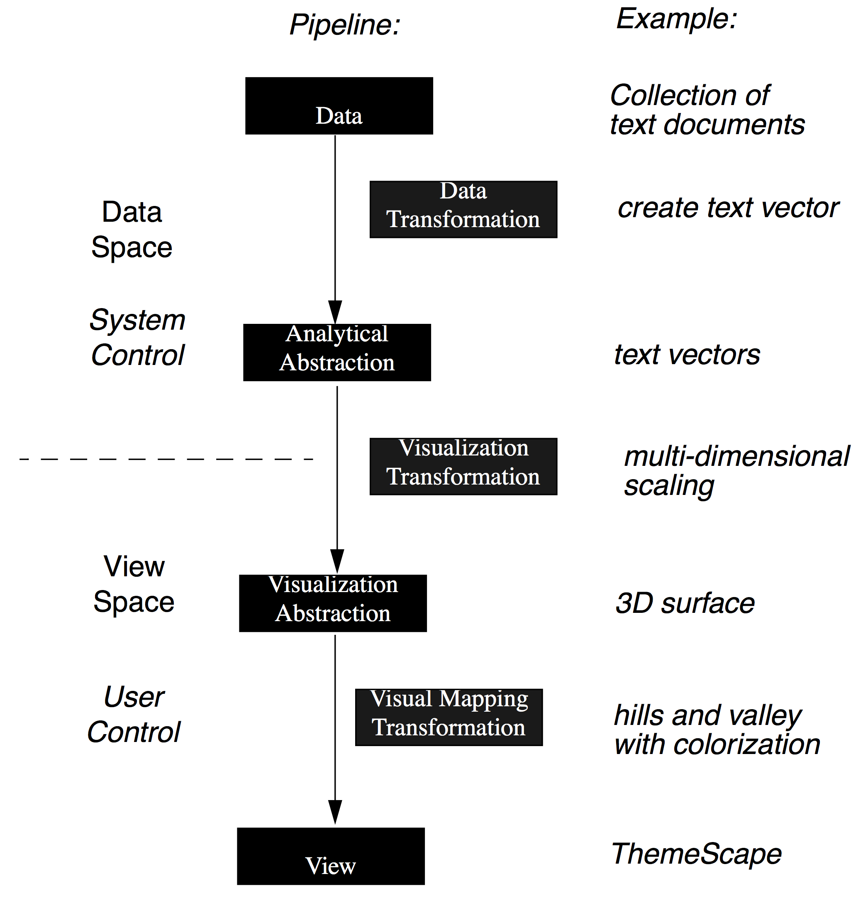

# Pipeline
The datavis pipeline is a conceptual framework illustrating how to map data to graphics.

## An Operator Interaction Framework for Visualization Systems [pdf](http://iihm.imag.fr/blanch/teaching/infovis/readings/1998-Chi_Riedl-Operator_Interaction_Framework.pdf)  
This version of the pipeline shows how the data is transformed from data space to abstractions that are usefuls to build the graphics in the view space.

## A Taxonomy of Visualization Techniques using the Data State Reference Model [pdf](http://web.simmons.edu/~benoit/infovis/chi02.pdf)  
This table is modified from a table in this other paper using this same pipeline to describe a taxonomy of graphics.

| Stage | Description |
|-------|-------------|
| Value | Raw data |
| Data Transformation | Analytical abstraction |
| Analytical Abstraction | Metadata |
| Visualization Transformation | Visualization abstraction |
| Visualization Abstraction | Visualizable information |
| Visual Mapping Transformation | Presents a graphical view |
| View | End-product of the visualization mapping |

### A simplified pipeline
**Data space** → **Pixel space** → **Interaction space**

## Summary
Data space
* Data collection (e.g.: from sensors)
* Raw Data (e.g.: database)
* Formatted data (e.g.: binary to JSON)
* Transformed data (e.g.: grouped by, sliced)
* Abstract data (e.g.: scaled, normalized, statistics, metadata)

Pixel space
* Mapped from data: x, y, height, width, angle, color, delta, total
* From chart type: adjacentTo, nestedIn, linkedTo
* From layout: adjacentTo, nestedIn, linkedTo

Interaction space
* Animation: transitions, dynamic storytelling
* Manipulators: widgets
* Retroaction

## Example of implementation  
[The Grammar of Graphics dataset](http://www.amazon.com/Grammar-Graphics-Statistics-Computing/dp/0387245448) (GoG) is one of the bible of datavis semiology. It describes a very thorough conceptual framework to build datavis using the datavis pipeline.  
variables (e.g., speed) → transformation (e.g., rank) → scale (e.g., log) → coordinate system (e.g., cartesian) → element and visual attributes (e.g., rectangle, color)

[GGplot2](http://www.amazon.com/ggplot2-Elegant-Graphics-Data-Analysis/dp/0387981403?ie=UTF8&ref_=cm_sw_su_dp&tag=ggplot2-20) is a datavis library for the statistical language R, closely following the GoG conceptual framework. Some attempts have been made to port the concept to Javascriot, but none really got traction yet. ((list of gg on js))

D3.js is taking inspiation from the Datavis pipeline and all these semiology conceptual frameworks. In my opinion, that's why it's so successful: it's probably the smallest set of tools you can get to implement a datavis pipeline on top of web technologies.
