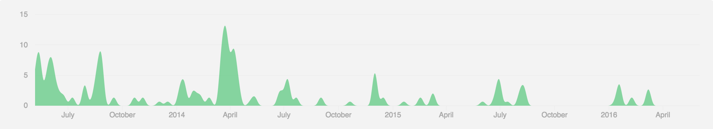

## D3 charts lib

* [dimple](http://dimplejs.org/)  
[Github](https://github.com/PMSI-AlignAlytics/dimple)  
An object-oriented API for business analytics

* [Rickshaw](http://code.shutterstock.com/rickshaw/)  
[Github](https://github.com/shutterstock/rickshaw)  
JavaScript toolkit for creating interactive real-time graphs

* [dc.js](http://dc-js.github.io/dc.js/)  
[Github](https://github.com/dc-js/dc.js)  
Multi-Dimensional charting built to work natively with crossfilter rendered with d3.js

* [Ember Charts](http://opensource.addepar.com/ember-charts/)  
[Github](https://github.com/Addepar/ember-charts)  
A charting library built with the Ember.js and d3.js frameworks. It includes time series, bar, pie, and scatter charts which are easy to extend and modify.

* [MetricsGraphics.js](http://metricsgraphicsjs.org/)  
[Github](https://github.com/mozilla/metrics-graphics)  
MetricsGraphics.js is a library built on top of D3 that is optimized for visualizing and laying out time-series data. It provides a simple way to produce common types of graphics in a principled, consistent and responsive way.

* [Epoch](http://fastly.github.io/epoch/)  
[Github](https://github.com/epochjs/epoch)  
Epoch is a general purpose charting library for application developers and visualization designers. It focuses on two different aspects of visualization programming: basic charts for creating historical reports, and real-time charts for displaying frequently updating timeseries data.

* [Plottable.js](http://plottablejs.org/)  
[Github](https://github.com/palantir/plottable)  
Plottable.js is a library of chart components for creating flexible, custom charts for websites. It is built on top of D3.js and provides higher-level pieces, like plots, gridlines, and axes.

* [glimpse.js](http://racker.github.io/glimpse.js-website/)  
[Github](https://github.com/racker/glimpse.js)  
A JavaScript library for making beautiful graphs and visualizations effortlessly.

* [Vega](https://vega.github.io/vega/)  
[Github](https://github.com/vega/vega)  
Vega is a visualization grammar, a declarative format for creating and saving interactive visualization designs. With Vega you can describe data visualizations in a JSON format, and generate interactive views using either HTML5 Canvas or SVG.

* [xCharts](https://github.com/tenxer/xCharts)  
[Github](https://github.com/tenxer/xCharts)  
A D3-based library for building custom charts and graphs

* [uvCharts](http://imaginea.github.io/uvCharts/)  
[Github](https://github.com/imaginea/uvCharts)  
Simple, robust, extensible JavaScript charting library built using d3 designed to help developers embed, build charts in less than couple of minutes.

* [Cubism.js](http://square.github.io/cubism/)  
[Github](https://github.com/square/cubism)  
Cubism.js is a D3 plugin for visualizing time series. Use Cubism to construct better realtime dashboards, pulling data from Graphite, Cube and other sources.

* [c3](http://c3js.org/)  
[Github](https://github.com/c3js/c3)  
c3 is a D3-based reusable chart library that enables deeper integration of charts into web applications.

* [TechanJS](http://techanjs.org/)  
[Github](https://github.com/andredumas/techan.js)  
A visual, technical analysis and charting library built on D3. Build interactive financial charts for modern and mobile browsers.

* [Firespray](https://github.com/boundary/firespray)  
[Github]()

* [Micropolar](http://micropolar.org/)  
[Github]()

* [D4](http://visible.io/)  
[Github](https://github.com/heavysixer/d4)  
A friendly reusable charts DSL for D3

* [NVD3](http://nvd3.org/)  
[Github](https://github.com/novus/nvd3)  
A reusable charting library written in d3.js

* [Chartbuilder](http://quartz.github.io/Chartbuilder/)  
[Github](https://github.com/Quartz/Chartbuilder/)  
A front-end charting application that facilitates easy creation of simple beautiful charts

* [Chart.js](http://www.chartjs.org/)  
[Github](https://github.com/chartjs/Chart.js)  
Simple yet flexible JavaScript charting for designers & developers

* [Angular-charts](http://chinmaymk.github.io/angular-charts/)  
[Github](https://github.com/chinmaymk/angular-charts)  
Angular directives for creating common charts using d3

* [react-d3](http://esbullington.github.io/react-d3-website/)  
[Github](https://github.com/yang-wei/rd3)  
Modular ReactJS charts made using d3 chart utilities.

* [DexCharts](https://github.com/PatMartin/dexjs)  
[Github](https://dexvis.wordpress.com/)  
Dex.js is a javascript framework for visual components.

* [DViz](https://github.com/akngs/dviz)  
DViz is a declarative data visualization library written in Javascript.

* [gg](http://sirrice.github.io/gg/)  
[Github](https://github.com/sirrice/gg/)  
Javascript DSL for Grammar of Graphics extended to support interactivity and backend data-processing support. Written in coffeescript

* [jsplotlib](https://github.com/rameshvs/jsplotlib)  
A matplotlib/MATLAB (TM) -inspired library for creating interactive plots with d3.js

* [LPChart](http://bergcloud.github.io/lp-chart/)  
[Github](https://github.com/bergcloud/lp-chart)  
LPChart is some JavaScript that makes it easier to draw line charts. It provides a simplified way of interacting with D3.js and is designed to be particularly useful when making publications for Little Printer.

* [Radian](http://openbrainsrc.github.io/Radian/index.html)  
[Github](https://github.com/openbrainsrc/Radian)  
Radian is a JavaScript library for producing interactive SVG plots in HTML using Angular JS and D3.js.

* [Dance.js](http://quasipartikel.at/2012/04/25/dancing-with-data/)  
[Github](https://github.com/michael/dance)  
Dance.js is a simple data-driven visualization framework. It's basically a flavor of Backbone.js, but enriched with some of the ideas of the very popular D3.js visualization framework.

* [Dynamic-Graphs](http://mlarocca.github.io/Dynamic-Charts/v0_2/)  
[Github](https://github.com/mlarocca/Dynamic-Charts)  
This is a high-level lib built on D3js to allow for easy and quick development of dynamically populated charts, especially thought to represent live, real-time data.

* [PykCharts.js](http://pykcharts.com/)  
[Github](https://github.com/pykih/PykCharts.js)  
26+ well-designed, themeable, responsive, real-time and easy to use charts and 109+ maps. 

* [D3plus](http://d3plus.org/)  
[Github](https://github.com/alexandersimoes/d3plus)  
A javascript library that extends D3.js to enable fast and beautiful visualizations.

* [Datamaps](http://datamaps.github.io/)  
[Github](https://github.com/markmarkoh/datamaps)  
Datamaps is intended to provide some data visualizations based on geographical data. It's SVG-based, can scale to any screen size, and includes everything inside of 1 script file.

* [d3-carto-maps](https://github.com/emeeks/d3-carto-map)  
d3.carto is a library for creating layer-based maps using D3. It allows you to easily make tile and vector maps that take advantage of D3's amazing geospatial functionality.

* [rCharts](http://ramnathv.github.io/rCharts/)  
[Github](https://github.com/ramnathv/rCharts)  
rCharts is an R package to create, customize and publish interactive javascript visualizations from R using a familiar lattice style plotting interface.

* [Koto](http://kotojs.org/)  
[Github](https://github.com/kotojs/kotojs)  
A framework for creating reusable charts with D3.js, written in ES6.

* [Peek](http://mtmacdonald.github.io/peek/)  
[Github](https://github.com/mtmacdonald/peek)  
Peek is a an object-oriented chart library for web applications, based on D3.js

## D3 plugins
[Official list](https://github.com/d3/d3/wiki/Plugins)